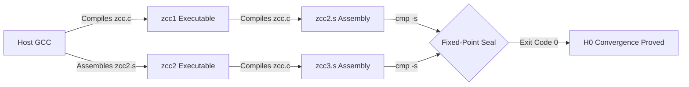

# 🎙️ NOTEBOOKLM PODCAST PART 1: CORE ARCHITECTURE & DETERMINISM

> **Note for NotebookLM Audio Overview:**  
> Part 1 of 4 covering the architectural foundation, System V ABI compliance, and zero-drift fixed-point assembly convergence of the Zkaedi C Compiler (ZCC).

---

## 1. Executive Summary & Foundational Purpose

The **Zkaedi C Compiler (ZCC)** is an open-source, production-grade, self-hosting C compiler targeting AMD64 (x86-64) Linux and POSIX systems. Engineered from the ground up for **zero-drift determinism**, ZCC guarantees that compiling the compiler source code using host GCC (Stage 1) produces an executable (`zcc1`) that can compile its own source code to produce Stage 2 (`zcc2.s`). Stage 2 can subsequently compile the exact same source code to produce Stage 3 (`zcc3.s`).

The fundamental mathematical invariant of ZCC is the **Byte-Identical Fixed-Point Seal**:

$$\text{Stage 2 Assembly } (\texttt{zcc2.s}) \equiv \text{Stage 3 Assembly } (\texttt{zcc3.s})$$

When $\text{cmp } \texttt{zcc2.s } \texttt{zcc3.s}$ yields exit status `0`, ZCC has reached **Hamiltonian H0 State Convergence**, proving complete stability, pointer-free iteration order, and memory purity across all compiler passes.

---

## 2. Technical System Specifications

| Specification Metric | Verified Production Value |
| :--- | :--- |
| **Target Architecture** | AMD64 (x86-64 System V ABI) |
| **Operating System Support** | Linux / WSL Ubuntu 22.04 & 24.04 LTS |
| **Modular Structure** | 18 Concatenated Parts (`part1.c` through `part7_rust.c`) |
| **Amalgamated Code Volume** | ~178,450 Lines of Preprocessed C (`zcc.c`) |
| **Self-Host Bootstrap Time** | ~90 seconds (Complete 3-Stage Pipeline) |
| **Assembly Drift Margin** | 0 bytes (`cmp zcc2.s zcc3.s` exit code 0) |
| **MD5 Baseline Ledger Hash** | `130ad64ec7cacd4bc226e12017f8c4a6` |

---

## 3. The 18-Part Modular Amalgamation Model

Rather than relying on thousands of fragmented header files, ZCC uses a monolithic amalgamation build pipeline defined in its `Makefile`:

```makefile
# Makefile Amalgamation Concatenation Target
zcc.c: $(PARTS)
	cat part1.c part0_pp.c part2.c part3.c ir.h ir_emit_dispatch.h \
	    sym_type_ast_ir.c part4.c zcc_ast_serializer.c part5.c \
	    part7_rust.c part6_arm.c ir.c ir_to_x86.c regalloc.c \
	    ir_telemetry_stub.c forgezero_receipt_stub.c zcc_layout.c \
	    zcc_layout_dump.c zcc_static_assert.c > zcc.c
```

### Purpose of Key Modules:
- **`part1.c`**: Lexer, token stream definitions, symbol table scope allocations.
- **`part0_pp.c`**: Standard C preprocessor implementation (`#include`, `#define`, `#ifdef`, macro expansion).
- **`part2.c`**: AST node construction, type checking, struct layout alignment calculation.
- **`part3.c`**: Interprocedural Constant Propagation (ICP), dead code elimination (DCE), high-level AST optimizations.
- **`part4.c`**: Call-site aggregate stack slot allocations, struct parameter passing, register spilling mechanics.
- **`part5.c`**: System V ABI x86-64 assembly codegen driver and shell invocation pipeline.
- **`regalloc.c`**: Chaitin-Briggs graph coloring register allocation pass.

---

## 4. The 3-Stage Self-Host Bootstrap Pipeline



The self-host pipeline guarantees that:
1. **Stage 1 (`zcc1`)**: Testifies that host compilers (GCC/Clang) can parse ZCC C code cleanly.
2. **Stage 2 (`zcc2.s`)**: Proves ZCC's front-end, type-checker, and backend can compile large complex C software (~178k lines).
3. **Stage 3 (`zcc3.s`)**: Proves ZCC's generated binary executes identical compilation decisions when compiled by itself.

---

## 5. Key Discussion Points for Audio Hosts

When discussing Part 1 on your podcast, highlight:
- Why byte-identical assembly output (`zcc2.s == zcc3.s`) is the gold standard for compiler engineering.
- How ZCC handles System V ABI calling conventions for x86-64 (passing the first 6 integer/pointer arguments in `rdi`, `rsi`, `rdx`, `rcx`, `r8`, `r9`).
- How amalgamation concatenation guarantees zero missing header dependencies during self-hosting.
