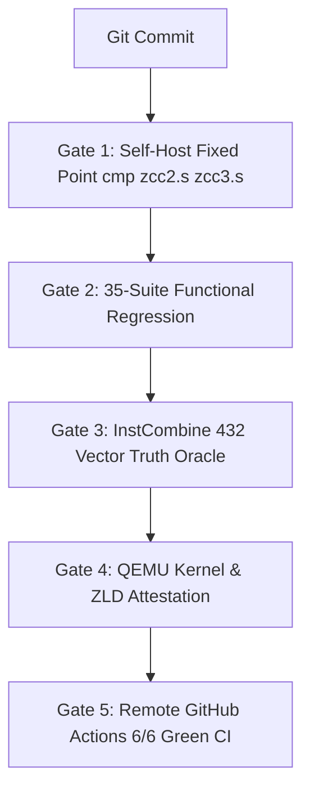

# 🎙️ NOTEBOOKLM PODCAST PART 3: THE 5 VERIFICATION GATES ENGINE

> **Note for NotebookLM Audio Overview:**  
> Part 3 of 4 breaking down the 5 verification gates protecting ZCC against regressions, including source code implementations of Gate 1, Gate 2, Gate 3, Gate 4, and Gate 5.

---

## 1. The 5-Gate Mathematical Assurance Pipeline

To guarantee that no patch introduces codegen drift, ABI violations, or silent optimization bugs, ZCC mandates a strict 5-gate pipeline:



---

## 2. Gate 1 — Self-Host Fixed-Point Assembly Seal

**Mandatory Requirement**: `cmp zcc2.s zcc3.s` must return exit status `0` (byte-identical output).

### Verbatim Source Code (`gate.sh` extract):
```bash
#!/usr/bin/env bash
set -eo pipefail

echo "=== STAGE 1: Host GCC -> zcc1 ==="
make zcc

echo "=== STAGE 2: zcc1 -> zcc2 ==="
./zcc zcc.c -o zcc2.s -S
gcc zcc2.s -o zcc2

echo "=== STAGE 3: zcc2 -> zcc3 ==="
./zcc2 zcc.c -o zcc3.s -S
gcc zcc3.s -o zcc3

echo "=== VERIFYING FIXED POINT SEAL ==="
if cmp -s zcc2.s zcc3.s; then
    echo "★ ZKAEDI PRIME FIXED POINT REPO - H0 CONVERGED - exit 0 (⟐ BYTE-IDENTICAL SEAL ⟐) ★"
    exit 0
else
    echo "FAIL: zcc2.s and zcc3.s differ!"
    diff -u zcc2.s zcc3.s | head -50
    exit 1
fi
```

---

## 3. Gate 2 — 35-Suite Functional Execution Regression

**Mandatory Requirement**: Every test case in `tests/test_*.c` must compile, execute natively on Linux/WSL, and match expected return codes.

### Verbatim Source Code (`zcc_test_suite.sh` extract):
```bash
#!/usr/bin/env bash
set -eo pipefail

PASSED=0
FAILED=0

for test_file in tests/test_*.c; do
    echo -n "Testing $test_file ... "
    if ./zcc "$test_file" -o /tmp/test_bin > /tmp/test_build.log 2>&1; then
        /tmp/test_bin > /tmp/test_run.log 2>&1
        ACTUAL_EXIT=$?
        EXPECTED_EXIT=$(grep "// EXPECT_EXIT:" "$test_file" | awk '{print $3}')
        EXPECTED_EXIT=${EXPECTED_EXIT:-0}
        
        if [ "$ACTUAL_EXIT" -eq "$EXPECTED_EXIT" ]; then
            echo "PASS"
            PASSED=$((PASSED + 1))
        else
            echo "FAIL (expected $EXPECTED_EXIT, got $ACTUAL_EXIT)"
            FAILED=$((FAILED + 1))
        fi
    else
        echo "BUILD FAIL"
        FAILED=$((FAILED + 1))
    fi
done

echo "Suite Summary: $PASSED PASSED, $FAILED FAILED"
[ "$FAILED" -eq 0 ] || exit 1
```

---

## 4. Gate 3 — InstCombine 432-Vector Truth Oracle

**Mandatory Requirement**: Compiles 432 vector optimization pairs under both Host GCC and ZCC, asserting 100% output identity.

### Verbatim Source Code (`tests/run_gate_instcombine.sh` extract):
```bash
#!/usr/bin/env bash
set -eo pipefail

echo "[GATE 3] Compiling InstCombine Oracle with Host GCC..."
gcc -O0 tests/test_instcombine_oracle.c -o /tmp/inst_gcc

echo "[GATE 3] Compiling InstCombine Oracle with ZCC..."
./zcc tests/test_instcombine_oracle.c -o /tmp/inst_zcc

echo "[GATE 3] Executing Vector Differential Comparison..."
/tmp/inst_gcc > /tmp/gcc_oracle.out
/tmp/inst_zcc > /tmp/zcc_oracle.out

if diff -q /tmp/gcc_oracle.out /tmp/zcc_oracle.out; then
    echo "GATE 3 PASS: 432 Vector Pairs Match GCC Reference Exactly."
    exit 0
else
    echo "GATE 3 FAIL: Vector divergence detected!"
    diff -u /tmp/gcc_oracle.out /tmp/zcc_oracle.out | head -40
    exit 1
fi
```

---

## 5. Gate 4 & Gate 5 — Real QEMU Boot & GitHub CI Attestation

- **Gate 4 (QEMU Bare-Metal Boot)**: Compiles `kmain.c` and boots it inside QEMU x86-64 emulator. Serial COM1 output must transmit `ZKAEDI_KERNEL_BOOT_OK`.
- **Gate 5 (GitHub Actions CI)**: Runs full 6-workflow remote pipeline (`boundary-gates`, `selfhost`, `zkaedi-compiler-ci`, `quantum-preflight`, `quantum-tests`, `pages`).

---

## 6. Key Discussion Points for Audio Hosts

When discussing Part 3 on your podcast, highlight:
- How having 5 distinct gates ensures that speed optimizations in Gate 3 don't break kernel booting in Gate 4.
- Why physical execution (`/tmp/test_bin`) is vastly superior to mock-only unit tests.
- How automated CI prevents broken commits from ever reaching the primary distribution branch.
