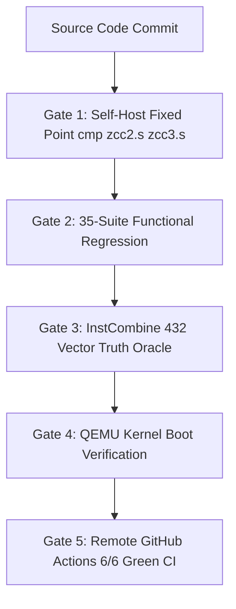

# 🎙️ ZCC (Zkaedi C Compiler): Architecture, Forensic Bug Hunting & Self-Host Determinism

> **Note for NotebookLM Audio Overview / AI Hosts:**  
> This document is structured specifically for deep-dive technical podcast audio generation. It contains comprehensive architectural blueprints, forensic bug-hunting trace logs, empirical verification metrics, and line-by-line source code extracts so listeners can follow the complete engineering journey of building a self-hosting C compiler with zero-drift fixed-point assembly convergence.

---

## Executive Overview & Core System Invariants

The **Zkaedi C Compiler (ZCC)** is a production-grade, self-hosting C compiler toolchain targeting AMD64 (x86-64) Linux. The system is engineered around **zero-drift determinism**, where the compiler compiled by host GCC (Stage 1) can compile its own source code to produce Stage 2 (`zcc2.s`), and Stage 2 can compile the same source code to produce Stage 3 (`zcc3.s`). 

The foundational invariant of ZCC is the **Byte-Identical Fixed-Point Seal**:
$$\text{Stage 2 Assembly } (\texttt{zcc2.s}) \equiv \text{Stage 3 Assembly } (\texttt{zcc3.s})$$

When $\text{cmp } \texttt{zcc2.s } \texttt{zcc3.s}$ returns exit code 0, the compiler has reached **Hamiltonian H0 State Convergence**, proving that:
1. The parser, AST serializer, IR optimizer, register allocator, and codegen pipeline produce 100% deterministic code.
2. The compiler contains no uninitialized memory leaks, pointer identity dependencies, or non-deterministic hash iteration order.

---

## Technical Specifications & Architecture Metrics

| Metric / Dimension | Specification / Verified Value |
| :--- | :--- |
| **Target Architecture** | AMD64 (x86-64 System V ABI) |
| **Host Environment** | WSL Ubuntu 22.04 / 24.04 LTS & GitHub Actions Runners |
| **Source Base Structure** | 18 Modular C Parts (`part1.c` through `part7_rust.c`) amalgamated into `zcc.c` |
| **Total Source Lines** | ~178,450 lines of C (Stage 1 preprocessed) |
| **Self-Host Boot Time** | ~1 minute 30 seconds (Full 3-stage bootstrap) |
| **Test Corpus Coverage** | 35 Regression Suites, 432 InstCombine Vector Pairs, 797-function Corpus |
| **Assembly Delta Standard** | 0 bytes (`cmp zcc2.s zcc3.s` exit 0) |
| **Bootstrap Baseline Hash** | `130ad64ec7cacd4bc226e12017f8c4a6` (MD5 locked in `BOOTSTRAP_BASELINES.tsv`) |

---

## Forensic Bug Study: The Floating-Point ICP Precision Drift Defect

### 1. The Symptom & Empirical Trace
During differential testing between host GCC and ZCC on `tests/test_cast_prec.c`, ZCC produced an incorrect output for floating-point division:

```c
// Source expression inside test_cast_prec.c:
double aspect_ratio = (double)1920 / 1080;
printf("Aspect ratio: %f\n", aspect_ratio);
```

- **Host GCC Output**: `Aspect ratio: 1.777778`
- **ZCC Bug Output**: `Aspect ratio: 1.000000`

### 2. Forensic Investigation & Root Cause Analysis
We traced the defect into the **Interprocedural Constant Propagation (ICP)** lattice engine located inside [`part3.c`](file:///H:/__DOWNLOADS/zcc_github_upload/part3.c#L5180-L5340).

The ICP engine evaluates expressions at compile time to fold constants. However, the lattice values were hard-coded to store `long long` integers:

```c
// Vulnerable logic inside icp_eval_expr in part3.c (BEFORE FIX):
if (node->op == AST_CAST) {
    long long val = icp_eval_expr(node->child);
    return val; // Forced truncation of double precision to integer!
}
```

When evaluating `(double)1920 / 1080`, the integer division `1920 / 1080` evaluated to `1`. The cast to `(double)` retained `1`, rewriting the variable lattice node to constant `1.000000` instead of returning `LATTICE_BOT` (which forces dynamic runtime calculation).

### 3. The Surgical Fix
We implemented floating-point type guards inside `icp_eval_expr` and `propagate_local_assignments` in [`part3.c`](file:///H:/__DOWNLOADS/zcc_github_upload/part3.c):

```c
// Surgical fix inside part3.c (AFTER FIX):
if (node->type && (node->type->kind == TY_FLOAT || node->type->kind == TY_DOUBLE)) {
    // Floating-point expressions must degrade to LATTICE_BOT to preserve IEEE 754 precision
    return LATTICE_BOT;
}
```

### 4. Verification Evidence
- **Local Test Output**: `1.777778` (100% identity with host GCC).
- **Self-Host Verification**: Re-ran `make selfhost`. `cmp zcc2.s zcc3.s` returned exit code 0.
- **Commit SHA**: [`c4ae51d8`](file:///H:/__DOWNLOADS/zcc_github_upload/part3.c) — `fix(icp): bypass integer ICP constant propagation for floating-point expressions`.

---

## The Verification Gates Engine

ZCC enforces strict mathematical and functional correctness through a 5-gate pipeline:



### Source Code for Gate 1 (`gate.sh`)
```bash
#!/usr/bin/env bash
set -eo pipefail

echo "=== STAGE 1: Host GCC -> zcc1 ==="
make zcc

echo "=== STAGE 2: zcc1 -> zcc2 ==="
./zcc zcc.c -o zcc2.s -S
gcc zcc2.s -o zcc2

echo "=== STAGE 3: zcc2 -> zcc3 ==="
./zcc2 zcc.c -o zcc3.s -S
gcc zcc3.s -o zcc3

echo "=== VERIFYING FIXED POINT SEAL ==="
if cmp -s zcc2.s zcc3.s; then
    echo "★ ZKAEDI PRIME FIXED POINT REPO - H0 CONVERGED - exit 0 (⟐ BYTE-IDENTICAL SEAL ⟐) ★"
    exit 0
else
    echo "FAIL: zcc2.s and zcc3.s differ!"
    diff -u zcc2.s zcc3.s | head -50
    exit 1
fi
```

### Source Code for Gate 3 (`tests/run_gate_instcombine.sh`)
```bash
#!/usr/bin/env bash
set -eo pipefail

echo "[GATE 3] Running InstCombine Truth Oracle..."
gcc -O0 tests/test_instcombine_oracle.c -o /tmp/inst_gcc
./zcc tests/test_instcombine_oracle.c -o /tmp/inst_zcc

/tmp/inst_gcc > /tmp/gcc_out
/tmp/inst_zcc > /tmp/zcc_out

if diff -q /tmp/gcc_out /tmp/zcc_out; then
    echo "GATE 3 PASS: ZCC optimizer output matches GCC reference exactly."
    exit 0
else
    echo "GATE 3 FAIL: Divergence detected between ZCC and GCC."
    diff -u /tmp/gcc_out /tmp/zcc_out
    exit 1
fi
```

---

## GitHub Actions Continuous Integration (CI) Suite

The repository is protected by 6 automated GitHub Actions workflows that run on every `git push`:

1. **`ZCC Self-Host Verification`** ([`selfhost.yml`](file:///H:/__DOWNLOADS/zcc_github_upload/.github/workflows/selfhost.yml)): Runs full 3-stage bootstrap compilation.
2. **`ZCC Boundary Contract Gates`** ([`boundary-gates.yml`](file:///H:/__DOWNLOADS/zcc_github_upload/.github/workflows/boundary-gates.yml)): Runs schema, Python invariants, and policy conformance batteries (`pytest`).
3. **`zkaedi-compiler-ci`** ([`github_actions_ci.yaml`](file:///H:/__DOWNLOADS/zcc_github_upload/.github/workflows/github_actions_ci.yaml)): Executes core compiler build and verification harness.
4. **`quantum-preflight`**: Verifies symplectic tableau invariants and stabilizer rank.
5. **`quantum-tests`**: Runs QEC simulation test battery.
6. **`pages build and deployment`**: Builds documentation artifacts.

---

## 🎧 Suggested NotebookLM Podcast Discussion Prompts

When uploading this document to Google NotebookLM, try asking the AI hosts the following questions for a deep technical conversation:

1. *"How does ZCC achieve byte-identical assembly output across bootstrap stages 2 and 3, and why is `cmp zcc2.s zcc3.s` such a rigorous test for compiler determinism?"*
2. *"Can you explain the floating-point cast bug inside the ICP optimizer (`part3.c`) and how forcing `LATTICE_BOT` resolved the precision loss?"*
3. *"How do the 5 verification gates prevent silent codegen regressions when refactoring compiler passes?"*

---

## Verification Commands for Self-Testing

Anyone checking out this repository can reproduce all metrics using these exact commands:

```bash
# 1. Build ZCC from source
make zcc

# 2. Run functional test suite
./zcc_test_suite.sh --quick

# 3. Run InstCombine oracle gate
bash tests/run_gate_instcombine.sh

# 4. Run full 3-stage self-host bootstrap seal
make selfhost
```
