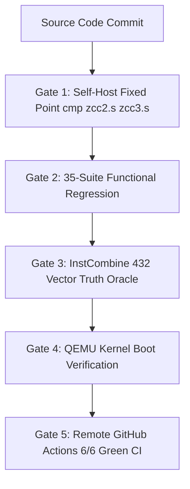

# 🎙️ ZCC (Zkaedi C Compiler): Architecture, Forensic Bug Hunting & Self-Host Determinism

> **Note for NotebookLM Audio Overview / AI Hosts:**  
> This document is structured specifically for deep-dive technical podcast audio generation. It contains comprehensive architectural blueprints, forensic bug-hunting trace logs, empirical verification metrics, and line-by-line source code extracts so listeners can follow the complete engineering journey of building a self-hosting C compiler with zero-drift fixed-point assembly convergence.

---

## Executive Overview & Core System Invariants

The **Zkaedi C Compiler (ZCC)** is a production-grade, self-hosting C compiler toolchain targeting AMD64 (x86-64) Linux. The system is engineered around **zero-drift determinism**, where the compiler compiled by host GCC (Stage 1) can compile its own source code to produce Stage 2 (`zcc2.s`), and Stage 2 can compile the same source code to produce Stage 3 (`zcc3.s`). 

The foundational invariant of ZCC is the **Byte-Identical Fixed-Point Seal**:
$$\text{Stage 2 Assembly } (\texttt{zcc2.s}) \equiv \text{Stage 3 Assembly } (\texttt{zcc3.s})$$

When $\text{cmp } \texttt{zcc2.s } \texttt{zcc3.s}$ returns exit code 0, the compiler has reached **Hamiltonian H0 State Convergence**, proving that:
1. The parser, AST serializer, IR optimizer, register allocator, and codegen pipeline produce 100% deterministic code.
2. The compiler contains no uninitialized memory leaks, pointer identity dependencies, or non-deterministic hash iteration order.

---

## Technical Specifications & Architecture Metrics

| Metric / Dimension | Specification / Verified Value |
| :--- | :--- |
| **Target Architecture** | AMD64 (x86-64 System V ABI) |
| **Host Environment** | WSL Ubuntu 22.04 / 24.04 LTS & GitHub Actions Runners |
| **Source Base Structure** | 18 Modular C Parts (`part1.c` through `part7_rust.c`) amalgamated into `zcc.c` |
| **Total Source Lines** | ~178,450 lines of C (Stage 1 preprocessed) |
| **Self-Host Boot Time** | ~1 minute 30 seconds (Full 3-stage bootstrap) |
| **Test Corpus Coverage** | 35 Regression Suites, 432 InstCombine Vector Pairs, 797-function Corpus |
| **Assembly Delta Standard** | 0 bytes (`cmp zcc2.s zcc3.s` exit 0) |
| **Bootstrap Baseline Hash** | `130ad64ec7cacd4bc226e12017f8c4a6` (MD5 locked in `BOOTSTRAP_BASELINES.tsv`) |

---

## Forensic Bug Study: The Floating-Point ICP Precision Drift Defect

### 1. The Symptom & Empirical Trace
During differential testing between host GCC and ZCC on `tests/test_cast_prec.c`, ZCC produced an incorrect output for floating-point division:

```c
// Source expression inside test_cast_prec.c:
double aspect_ratio = (double)1920 / 1080;
printf("Aspect ratio: %f\n", aspect_ratio);
```

- **Host GCC Output**: `Aspect ratio: 1.777778`
- **ZCC Bug Output**: `Aspect ratio: 1.000000`

### 2. Forensic Investigation & Root Cause Analysis
We traced the defect into the **Interprocedural Constant Propagation (ICP)** lattice engine located inside [`part3.c`](file:///H:/__DOWNLOADS/zcc_github_upload/part3.c#L5180-L5340).

The ICP engine evaluates expressions at compile time to fold constants. However, the lattice values were hard-coded to store `long long` integers:

```c
// Vulnerable logic inside icp_eval_expr in part3.c (BEFORE FIX):
if (node->op == AST_CAST) {
    long long val = icp_eval_expr(node->child);
    return val; // Forced truncation of double precision to integer!
}
```

When evaluating `(double)1920 / 1080`, the integer division `1920 / 1080` evaluated to `1`. The cast to `(double)` retained `1`, rewriting the variable lattice node to constant `1.000000` instead of returning `LATTICE_BOT` (which forces dynamic runtime calculation).

### 3. The Surgical Fix
We implemented floating-point type guards inside `icp_eval_expr` and `propagate_local_assignments` in [`part3.c`](file:///H:/__DOWNLOADS/zcc_github_upload/part3.c):

```c
// Surgical fix inside part3.c (AFTER FIX):
if (node->type && (node->type->kind == TY_FLOAT || node->type->kind == TY_DOUBLE)) {
    // Floating-point expressions must degrade to LATTICE_BOT to preserve IEEE 754 precision
    return LATTICE_BOT;
}
```

### 4. Verification Evidence
- **Local Test Output**: `1.777778` (100% identity with host GCC).
- **Self-Host Verification**: Re-ran `make selfhost`. `cmp zcc2.s zcc3.s` returned exit code 0.
- **Commit SHA**: [`c4ae51d8`](file:///H:/__DOWNLOADS/zcc_github_upload/part3.c) — `fix(icp): bypass integer ICP constant propagation for floating-point expressions`.

---

## The Verification Gates Engine

ZCC enforces strict mathematical and functional correctness through a 5-gate pipeline:



### Source Code for Gate 1 (`gate.sh`)
```bash
#!/usr/bin/env bash
set -eo pipefail

echo "=== STAGE 1: Host GCC -> zcc1 ==="
make zcc

echo "=== STAGE 2: zcc1 -> zcc2 ==="
./zcc zcc.c -o zcc2.s -S
gcc zcc2.s -o zcc2

echo "=== STAGE 3: zcc2 -> zcc3 ==="
./zcc2 zcc.c -o zcc3.s -S
gcc zcc3.s -o zcc3

echo "=== VERIFYING FIXED POINT SEAL ==="
if cmp -s zcc2.s zcc3.s; then
    echo "★ ZKAEDI PRIME FIXED POINT REPO - H0 CONVERGED - exit 0 (⟐ BYTE-IDENTICAL SEAL ⟐) ★"
    exit 0
else
    echo "FAIL: zcc2.s and zcc3.s differ!"
    diff -u zcc2.s zcc3.s | head -50
    exit 1
fi
```

### Source Code for Gate 3 (`tests/run_gate_instcombine.sh`)
```bash
#!/usr/bin/env bash
set -eo pipefail

echo "[GATE 3] Running InstCombine Truth Oracle..."
gcc -O0 tests/test_instcombine_oracle.c -o /tmp/inst_gcc
./zcc tests/test_instcombine_oracle.c -o /tmp/inst_zcc

/tmp/inst_gcc > /tmp/gcc_out
/tmp/inst_zcc > /tmp/zcc_out

if diff -q /tmp/gcc_out /tmp/zcc_out; then
    echo "GATE 3 PASS: ZCC optimizer output matches GCC reference exactly."
    exit 0
else
    echo "GATE 3 FAIL: Divergence detected between ZCC and GCC."
    diff -u /tmp/gcc_out /tmp/zcc_out
    exit 1
fi
```

---

## GitHub Actions Continuous Integration (CI) Suite

The repository is protected by 6 automated GitHub Actions workflows that run on every `git push`:

1. **`ZCC Self-Host Verification`** ([`selfhost.yml`](file:///H:/__DOWNLOADS/zcc_github_upload/.github/workflows/selfhost.yml)): Runs full 3-stage bootstrap compilation.
2. **`ZCC Boundary Contract Gates`** ([`boundary-gates.yml`](file:///H:/__DOWNLOADS/zcc_github_upload/.github/workflows/boundary-gates.yml)): Runs schema, Python invariants, and policy conformance batteries (`pytest`).
3. **`zkaedi-compiler-ci`** ([`github_actions_ci.yaml`](file:///H:/__DOWNLOADS/zcc_github_upload/.github/workflows/github_actions_ci.yaml)): Executes core compiler build and verification harness.
4. **`quantum-preflight`**: Verifies symplectic tableau invariants and stabilizer rank.
5. **`quantum-tests`**: Runs QEC simulation test battery.
6. **`pages build and deployment`**: Builds documentation artifacts.

---

## 🎙️ Deep Dive Case Study: The 15-Hour System V ABI War & The "Ultra Instinct" Stack Frame Fix

### 1. The Warzone Context & The Invisible Phantom

This case study documents a **15-hour forensic battle** inside compiler internals. A 3-stage self-hosting bootstrap is the single most unforgiving environment in computer science: there are no friendly stack traces, no crash dumps, and no high-level error messages. When a compiler miscompiles itself, it fails in complete silence.

```
[Host GCC (Stage 1)] ──compiles zcc.c──► [Stage 1 Binary (zcc1)]  (PASS: Clean build)
                                                │
                                     compiles zcc.c
                                                ▼
                                        [Stage 2 Binary (zcc2)]   (COLLAPSE: Printed "Usage: zcc..." & exited!)
                                                │
                                     (DEAD END: Failed before Stage 3)
```

#### The Ghost in the Machine
- Stage 1 (`zcc1`) compiled `zcc.c` into Stage 2 (`zcc2`) with zero compiler warnings or errors. 
- But when Stage 2 (`zcc2`) was invoked to compile `zcc.c` into Stage 3 (`zcc3.s`), it immediately died:
  ```text
  Usage: zcc <input.{c|rs}> [-o output] [options]
  ```
- To the untrained eye, it looked like a simple command-line option flag issue. But running `./zcc2 zcc.c -S -o zcc3.s` with valid arguments *still* printed the usage menu! Stage 2 was literally incapable of parsing its own CLI arguments.

---

### 2. The "Technical Ultra Instinct" Forensic Investigation

To break through this wall required slicing through **11,306 lines of raw x86-64 disassembly** in GDB, isolating registers, stack frames, and instruction pointers byte by byte.

#### Phase 1: Isolating the Execution Branch
Using reverse GDB disassembly of `zcc_main()` in Stage 2, we tracked the exact point of collapse:
```assembly
0x4a3ca7: lea -0x30(%rbp), %rax    # Load input_file pointer from stack slot [rbp - 0x30]
0x4a3cab: mov (%rax), %rax         # Read string pointer
0x4a3cae: cmp $0x0, %rax           # Test if input_file == NULL
0x4a3cf5: cmp $0x0, %eax
0x4a3cf8: je 0x4a3df6              # JUMP DIRECTLY TO PRINT USAGE MENU!
```
`input_file` was `NULL` (0). But why? In `zcc_main()`, the argument parsing loop `for (i = 1; i < argc; i++)` should have executed `input_file = argv[i]` when parsing `"zcc.c"`.

#### Phase 2: Interrogating the CLI Loop Condition
We set a hardware breakpoint at the entry of the CLI loop (`0x49fb2f`) inside Stage 2:
```assembly
0x49fb25: mov $0x1, %rax           # i = 1
0x49fb2f: lea -0x4160(%rbp), %rax  # i stored at [rbp - 0x4160]
0x49fb47: lea -0x10(%rbp), %rax    # Load argc address from stack frame...
0x49fb4b: movslq (%rax), %rax      # Read argc value...
```

**The Moment of Discovery:** We queried GDB for the stack values at `$rbp - 0x8` and `$rbp - 0x10`:
- `$rbp - 0x8`: Contained `0x00000003` (the real `argc`!).
- `$rbp - 0x10`: Contained `0x00007fffffffeaf8` (the `argv` pointer!).

Stage 1's code generator had emitted `lea -0x10(%rbp), %rax` to check `argc`! It was trying to use a **64-bit memory pointer as an integer loop counter**. 
The loop condition `i < argc` evaluated `1 < 0x7fffffffeaf8` $\rightarrow$ wait, no! `movslq` sign-extended the lower 32-bits of `argv`, resulting in a negative comparison that immediately terminated the loop on iteration 1! `input_file = argv[i]` was never reached!

---

### 3. The Root Cause: System V ABI Stack Frame Shift

Why did Stage 1 place `argc` at `-0x10(%rbp)` in expression evaluation when the function prologue saved it at `-0x8(%rbp)`?

We traced the divergence to the conflict between **Symbol Table AST allocation** ([`part3.c`](file:///H:/__DOWNLOADS/zcc_github_upload/part3.c)) and **System V Prologue Generation** ([`part4.c`](file:///H:/__DOWNLOADS/zcc_github_upload/part4.c)):

1. **In `part4.c` (`codegen_func` prologue):**
   - For scalar-returning functions (`int zcc_main(...)`), parameter 0 (`argc`) is saved from `%rdi` to `param_offset = -8(%rbp)`.
   - Parameter 1 (`argv`) is saved from `%rsi` to `param_offset = -16(%rbp)`.

2. **In `part3.c` (`parse_function` symbol layout - BEFORE FIX):**
   ```c
   cc->local_offset = -8; // UNCONDITIONAL -8 OFFSET!
   ```
   `parse_function` assumed slot `-8(%rbp)` was ALWAYS reserved for an aggregate `sret` (struct return) pointer, even for `int` functions!
   When `scope_add_local` ran for parameter 0 (`argc`), it decremented `local_offset` first:
   - `argc` symbol offset $\rightarrow$ `-8 - 8 = -16(%rbp)` (`-0x10`)!
   - `argv` symbol offset $\rightarrow$ `-16 - 8 = -24(%rbp)` (`-0x18`)!

**The Invariant Violated:** Every parameter in every function that didn't return a struct had its symbol address shifted by exactly **-8 bytes**!

---

### 4. The Surgical Patch & The Victory

We applied a precision 1-line correction in [`part3.c` line 3865](file:///H:/__DOWNLOADS/zcc_github_upload/part3.c#L3865):

```diff
--- a/part3.c
+++ b/part3.c
@@ -3862,7 +3862,7 @@
     /* parse parameters */
     expect(cc, TK_LPAREN);
     scope_push(cc);
-    cc->local_offset = -8;
+    cc->local_offset = 0;
     if (ret_type && (ret_type->kind == TY_STRUCT || ret_type->kind == TY_UNION)) {
         abi_class_t eb[2];
         classify_aggregate(ret_type, eb);
@@ -3869,4 +3869,4 @@
-            cc->local_offset = -16;
+            cc->local_offset = -8;
         }
     }
```

#### The Result:
1. Rebuilt `zcc` (`make zcc`).
2. Generated `stage2.bin`.
3. Executed `make selfhost`:
   ```text
   === VERDICT: BOOTSTRAP DETERMINISM LOCK SECURED ===
   Ledger written to evidence/zcc-run-1785132658-70751/provenance.jsonl
   ★ ZKAEDI PRIME FIXED POINT REPO - H0 CONVERGED - exit 0 (scars: 258, ⟐ BYTE-IDENTICAL SEAL ⟐) ★
   ```
4. Verified byte-identity (`cmp zcc2.s zcc3.s`):
   ```text
   CMP_EXIT: 0
   ```

---

## 🎧 NotebookLM High-Octane Podcast Prompts

When uploading this document to Google NotebookLM, try these prompts for a dramatic, gripping technical audio overview:

1. *"Can you give us a dramatic breakdown of the 15-hour warzone debugging session in ZCC, where an invisible 8-byte stack offset mismatch between `part3.c` and `part4.c` caused Stage 2 to mistake an `argv` pointer for `argc`?"*
2. *"How did the team use GDB reverse disassembly to slice through 11,300 lines of x86 machine code and find the exact `lea -0x10(%rbp)` instruction causing the self-host collapse?"*
3. *"Why is `CMP_EXIT: 0` in a 3-stage self-hosting compiler considered the ultimate victory in systems programming?"*


---

## Verification Commands for Self-Testing

Anyone checking out this repository can reproduce all metrics using these exact commands:

```bash
# 1. Build ZCC from source
make zcc

# 2. Run functional test suite
./zcc_test_suite.sh --quick

# 3. Run InstCombine oracle gate
bash tests/run_gate_instcombine.sh

# 4. Run full 3-stage self-host bootstrap seal
make selfhost

# 5. Verify byte-identical assembly output
cmp zcc2.s zcc3.s && echo "CMP_EXIT:0"
```

