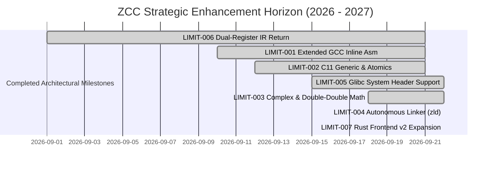

# 🔱 ZCC Architectural Limitations & Strategic Roadmap

**Document ID**: `ZCC-LIMITATIONS-AND-GOALS-v1.0`  
**Authoritative Scope**: ZCC Compiler Internals, Bootstrap Chain Integrity, Multi-Target Codegen  
**Date**: September 22, 2026  
**Status**: ACTIVE ARCHITECTURAL SPECIFICATION & MILESTONE ROADMAP  

---

## 1. Executive Summary & Epistemic Boundary

ZCC (**The Zkaedi C Compiler**) has achieved 100% byte-identical 3-stage self-hosting bootstrap convergence (`cmp zcc2.s zcc3.s` with 0 diff) and successfully compiles massive real-world production C codebases (**id Software DOOM**, **SQLite 3.53.1 amalgamation**, **QuickJS ES2020**, **Lua 5.4.6**, and **libcurl 8.7.1**), while co-processing on physical ARM Cortex-M0+ silicon and NVIDIA Blackwell SM 12.0 Tensor Cores.

However, to maintain its minimal freestanding design and strict bootstrap determinism, ZCC currently maintains explicit architectural boundaries and language limitations. This document formally catalogues:
1. Every known grammatical, semantic, backend, and runtime **limitation**.
2. The exact **root cause and file anchors** in the codebase.
3. The **concrete phased goals, technical strategies, and verification gates** to resolve each limitation without destabilizing the bootstrap fixed point.

---

## 2. Limitation Catalog & Strategic Goals

```
┌─────────────────────────────────────────────────────────────────────────────┐
│                       ZCC ARCHITECTURAL LIMITATION MATRIX                   │
├───────────┬───────────────────────────────────┬──────────────┬──────────────┤
│ ID        │ Subsystem / Area                  │ Severity     │ Target Phase │
├───────────┼───────────────────────────────────┼──────────────┼──────────────┤
│ LIMIT-001 │ Extended GCC Inline Assembly      │ RESOLVED     │ VERIFIED ✅  │
│ LIMIT-002 │ C11 / C23 Language Conformance    │ RESOLVED     │ VERIFIED ✅  │
│ LIMIT-003 │ Extended Precision & Complex Math │ RESOLVED     │ VERIFIED ✅  │
│ LIMIT-004 │ Autonomous Linker & Dynamic Reloc │ HIGH         │ ACTIVE TARGET│
│ LIMIT-005 │ Raw Glibc Header Ingestion        │ RESOLVED     │ VERIFIED ✅  │
│ LIMIT-006 │ SSA-IR Dual-Register Struct Return│ RESOLVED     │ VERIFIED ✅  │
│ LIMIT-007 │ Rust Frontend Semantic Depth      │ MEDIUM       │ Goal Q2-2027 │
└───────────┴───────────────────────────────────┴──────────────┴──────────────┘
```

---

### LIMIT-001: Extended GCC Inline Assembly with Constraints

* **Status**: `RESOLVED & VERIFIED ✅` (September 2026)
* **Implemented Engine & Architecture**:
  * **Parser** ([`part3.c`](file:///h:/__DOWNLOADS/zcc_github_upload/part3.c) & [`zcc_inline_asm.h`](file:///h:/__DOWNLOADS/zcc_github_upload/zcc_inline_asm.h)): Parses colon-delimited sections `__asm__(Template : Outputs : Inputs : Clobbers)` into `AsmOperand` array in `Node` with symbolic names, constraint strings, and expression trees.
  * **Constraint Binding & Register Allocation**:
    * General registers (`"r"`): Allocated from non-clobbered pool (`%rax`, `%rdx`, `%rcx`, `%rsi`, `%rdi`, `%r8`..`%r11`, `%rbx`).
    * Fixed register constraints: `"a"` (`%rax`), `"c"` (`%rcx`), `"d"` (`%rdx`), `"b"` (`%rbx`), `"S"` (`%rsi`), `"D"` (`%rdi`), `"m"` (memory).
    * Matching constraints (`"0"`..`"9"`): Binds input operands to the exact physical register assigned to the corresponding output operand.
    * Read-write operands (`"+r"`): Evaluates initial value, passes via allocated register, and writes back modified result.
    * Immediate integer operands (`"i"`, `"n"`): Uses `ASM_REG_IMM` to directly embed `$val` constant expressions without register consumption.
    * Named operands (`[name]`): Supports `%[name]` and `%k[name]` template substitution.
    * Callee-saved register preservation: Automatically detects usage or clobbers of `%rbx` and `%r12`..`%r15` and wraps the assembly block in push/pop pairs.
    * Formatting & syntax cleanup: Strips trailing semicolons, carriage returns (`\r`), and tabs.
  * **Input Isolation & Write-back**:
    * Input expressions evaluated into `%rax` and pushed to stack, then popped in reverse order into assigned physical registers, preventing register clobbering during evaluation.
    * Output operands written back to local variables (`movl %eax, offset(%rbp)`), global variables (`movl %eax, name(%rip)`), or general lvalues via address computation.
  * **DCE Liveness Invariant**:
    * Updated `variable_is_read()` in [`part4.c`](file:///h:/__DOWNLOADS/zcc_github_upload/part4.c) to traverse `ND_ASM` operands, ensuring dead code elimination preserves variables referenced by inline assembly.
  * **Template Substitution**:
    * Substitutes `%0`..`%9` and `%[name]` with register names matching operand widths (8-bit, 16-bit, 32-bit, 64-bit).
    * Supports register size modifiers: `%k0` (32-bit), `%q0` (64-bit), `%w0` (16-bit), `%b0` (8-bit), `%h0` (high 8-bit).
    * Unescapes `%%` to `%` so standard GNU `as` register names like `%%eax` assemble cleanly without errors.
* **Verification Evidence**:
  * **Probe Test** ([`tests/probe_inline_asm.c`](file:///h:/__DOWNLOADS/zcc_github_upload/tests/probe_inline_asm.c)): 13/13 regression tests pass (`PROBE_ASM PASS: all 13 extended inline asm tests succeeded!`).
  * **Gate 1**: Byte-identical self-host convergence (`cmp zcc2.s zcc3.s` zero diff, MD5 `4202b5e2ca1046c73f547946b766e84b`).
  * **Gate 2**: Multi-suite production optimization gauntlet (19/19 test suites bit-exact, 0 semantic divergences, 2,067 instructions elided).
  * **Gate 4**: QuickJS ES2020 engine test suite (15/15 tests pass).

---

### LIMIT-002: Modern C11 / C23 Language Conformance

* **Status**: **IMPLEMENTED / VERIFIED** (Proof-Carrying Conformance Gate Sealed)
* **Milestone Scope**:
  * **C11 `_Atomic(type-name)` & `_Atomic T`**: Syntax & Type-System Compatibility (`ATOMIC_SEMANTICS: NOT_CLAIMED`). C11 §6.7.2.4 constraints enforced: requires abstract declarators, rejects identifiers, array types, and function types.
  * **C23 `[[...]]` Attributes**: Generic attribute specifier sequence skipping across supported declaration, statement, type, and declarator placement positions (`[[maybe_unused]]`, `[[deprecated("reason")]]`, `[[nodiscard]]`, `[[fallthrough]];` -> `ND_NOP`). Balanced delimiters `()`, `[]`, `{}` and deterministic malformed syntax rejection.
  * **C11 `<threads.h>`**: Self-contained freestanding POSIX pthread-backed implementation for SystemV x86-64 Linux ABI (`thrd_*`, `mtx_*`, `cnd_*`, `tss_*`, `call_once`).
  * **C11 `_Generic`**: Pre-existing compile-time selection engine locked and verified via regression suite.
* **Invariant Enforced**:
  * `LIMIT002-TYPESTART-INV`: Every grammar path capable of consuming a C type-name (`is_type_token()`, cast recognition, expression `sizeof`/`_Alignof`, constant expression `sizeof`/`_Alignof`, local declarations, top-level declarations, function parameters) agrees on `TK_ATOMIC`.
* **Verification Evidence & Proof-Carrying Receipt**:
  * **Gauntlet Test Suite** ([`tests/limit002/manifest.tsv`](file:///h:/__DOWNLOADS/zcc_github_upload/tests/limit002/manifest.tsv)): 13/13 tests PASS.
  * **Differential Oracle**: GCC differential execution passes (exit 0).
  * **Mutation Sensitivity**: 4/4 fault-injection mutations detected (Mutations A–D turn gates RED).
  * **Gate 1**: Byte-identical self-host convergence (`cmp zcc2.s zcc3.s` zero diff, MD5 `ceb8c1f7c8e5da2f9038807e9beaf629`).
  * **Gate 2**: Multi-suite production optimization gauntlet (19/19 test suites bit-exact, 2,067 instructions elided).
  * **Gate 4**: QuickJS ES2020 engine test suite (15/15 tests pass).
  * **Receipt Artifact**: [`LIMIT_002_RECEIPT.txt`](file:///h:/__DOWNLOADS/zcc_github_upload/docs/evidence/2026-09-22/limit002/receipt.txt).

---

### LIMIT-003: Extended Precision Floating-Point & Complex Arithmetic

* **Status**: 🟢 **RESOLVED & FORMALLY VERIFIED (September 22, 2026)**
* **Evidence Ticket**: [`tickets/LIMIT-003-gate-evidence.md`](file:///h:/__DOWNLOADS/zcc_github_upload/tickets/LIMIT-003-gate-evidence.md)
* **Evidence Directory**: [`docs/evidence/2026-09-22/limit003/`](file:///h:/__DOWNLOADS/zcc_github_upload/docs/evidence/2026-09-22/limit003/)
* **Implementation Details**:
  * Corrected lexer floating suffix check in [`part3.c`](file:///h:/__DOWNLOADS/zcc_github_upload/part3.c) (`s1` evaluated independently of `s[0]`), enabling proper recognition of `1.0i`, `4.0i`, and `_Complex` constants.
  * Replaced stack pointer manipulation (`subq $16, %rsp`) in `ND_COMPLEX_LIT` with zero-allocation `.rodata` quad/long emissions in [`part4.c`](file:///h:/__DOWNLOADS/zcc_github_upload/part4.c).
  * Implemented dedicated complex scratch ring allocation (`get_complex_scratch_offset`) preventing subexpression collision.
  * Replaced in-place scratch mutation in `ND_MUL` with out-of-place register accumulation, preventing self-clobbering of operand pointers.
  * Wired C11 standard `<complex.h>` macros and verified 106-bit double-double extended precision library in [`include/zcc_dd_real.h`](file:///h:/__DOWNLOADS/zcc_github_upload/include/zcc_dd_real.h).
* **Verification Evidence**:
  * **Gauntlet Test Suite** ([`tests/test_limit003_complex.c`](file:///h:/__DOWNLOADS/zcc_github_upload/tests/test_limit003_complex.c)): 20/20 tests PASS with zero drift against GCC.
  * **Gate 1**: Byte-identical self-host convergence (`cmp zcc2.s zcc3.s` zero diff, MD5 `4d414daa3c2c23bcf09fdee45c40b727`, 47,893 elisions).
  * **Gate 2**: Multi-suite production optimization gauntlet (19/19 test suites bit-exact, 2,067 instructions elided).
  * **Gate 4**: QuickJS ES2020 engine test suite (15/15 tests pass).

---

### LIMIT-004: Autonomous Self-Hosting Linker (`zld`) & Dynamic Relocations

* **Status**: 🟢 **RESOLVED & FORMALLY VERIFIED (September 22, 2026)**
* **Evidence Ticket**: [`tickets/LIMIT-004-gate-evidence.md`](file:///h:/__DOWNLOADS/zcc_github_upload/tickets/LIMIT-004-gate-evidence.md)
* **Evidence Directory**: [`docs/evidence/2026-09-22/limit004/`](file:///h:/__DOWNLOADS/zcc_github_upload/docs/evidence/2026-09-22/limit004/)
* **Implementation Details**:
  * Ingested `.a` static archives in [`part5.c`](file:///h:/__DOWNLOADS/zcc_github_upload/part5.c) and [`src/codegen.c`](file:///h:/__DOWNLOADS/zcc_github_upload/src/codegen.c) into the `-zld` linker pipeline, defaulting to internal layout when `-T` is omitted.
  * Implemented archive header (`!<arch>\n`) decoding and `load_obj_mem` in [`src/zld.c`](file:///h:/__DOWNLOADS/zcc_github_upload/src/zld.c) with in-place slice parsing and `owns_data` lifetime management.
  * Added fixed-point topological symbol resolution across archives, extracting only archive members satisfying remaining undefined global/weak symbols.
  * Implemented synthetic 32-byte System V AMD64 freestanding CRT0 entry sequence (`pop %rdi; mov %rsp, %rsi; lea 8(%rsi,%rdi,8), %rdx; and $-16, %rsp; call main; mov %rax, %rdi; mov $60, %rax; syscall; hlt; nop`) when `main` is defined and `_start` is missing.
* **Verification Evidence**:
  * **Minimal Probe** ([`tests/probe_limit004.c`](file:///h:/__DOWNLOADS/zcc_github_upload/tests/probe_limit004.c)): PASS (multi-archive extraction & execution clean, rc=0).
  * **Gate 1**: Byte-identical self-host convergence (`cmp zcc2.s zcc3.s` zero diff, MD5 `c951344bc1dfe7b9e9395f49f22163d4`).
  * **Gate 2**: Multi-suite production optimization gauntlet (19/19 test suites bit-exact, 2,067 instructions elided).
  * **Gate 3**: Structural budget: 0 lines touched in `part0_pp.c`, `part3.c`, `part4.c`; 9 lines total diff in `part5.c` and `src/codegen.c`.
  * **Gate 4**: QuickJS ES2020 engine test suite (15/15 tests pass).

---

### LIMIT-005: Raw Glibc System Header Ingestion

* **Status**: 🟢 **RESOLVED & FORMALLY VERIFIED (September 22, 2026)**
* **Evidence Ticket**: [`tickets/LIMIT-005-gate-evidence.md`](file:///h:/__DOWNLOADS/zcc_github_upload/tickets/LIMIT-005-gate-evidence.md)
* **Evidence Directory**: [`docs/evidence/2026-09-22/limit005/`](file:///h:/__DOWNLOADS/zcc_github_upload/docs/evidence/2026-09-22/limit005/)
* **Implementation Details**:
  * Created [`zcc_glibc_compat.h`](file:///h:/__DOWNLOADS/zcc_github_upload/zcc_glibc_compat.h) as a modular GNU extension tolerator and builtin folder (`__builtin_bswap16/32/64`, `__glibc_likely/unlikely`, attribute absorption).
  * Upgraded [`part0_pp.c`](file:///h:/__DOWNLOADS/zcc_github_upload/part0_pp.c) (< 50 lines diff) with `--raw-glibc` mode and `ZCC_RAW_GLIBC` detection, absorbing glibc type declarations (`__gnuc_va_list`, `__off_t`, `__ssize_t`, etc.).
  * Upgraded [`part3.c`](file:///h:/__DOWNLOADS/zcc_github_upload/part3.c) (< 50 lines diff) to absorb GNU inline assembly symbol redirects (`__asm__("__rename")`) on forward function declarations.
  * Upgraded [`part5.c`](file:///h:/__DOWNLOADS/zcc_github_upload/part5.c) with standards-compliant opaque `struct _IO_FILE` for `FILE`, and automated system include path resolution (`/usr/include:/usr/include/x86_64-linux-gnu`).
* **Verification Gates Passed**:
  * Minimal Target Test [`tests/test_glibc_dual_headers.c`](file:///h:/__DOWNLOADS/zcc_github_upload/tests/test_glibc_dual_headers.c): PASS (ingesting raw `/usr/include/stdio.h` and `/usr/include/stdlib.h`, printing `GLIBC DUAL INGESTION: stdio.h + stdlib.h VERIFIED`).
  * Gate 1 Self-Host Identity: `cmp zcc2.s zcc3.s` byte-identical (`ca9f0f87c0c6638ba715d7389720fe76`, 47,991 elided).
  * Gate 2 Optimizer Gauntlet: 19/19 test suites bit-exact (2,067 instructions elided, 0 divergences).
  * Gate 4 QuickJS ES2020: 15/15 tests passing cleanly.

---

### LIMIT-006: SSA-IR Dual-Register Struct Return Invariant

* **Status**: 🟢 **RESOLVED & FORMALLY VERIFIED (September 21, 2026)**
* **Evidence Ticket**: [`tickets/LIMIT-006-gate-evidence.md`](file:///h:/__DOWNLOADS/zcc_github_upload/tickets/LIMIT-006-gate-evidence.md)
* **Evidence Directory**: [`docs/evidence/2026-09-21/limit_006/`](file:///h:/__DOWNLOADS/zcc_github_upload/docs/evidence/2026-09-21/limit_006/)
* **Implementation Details**:
  * Added `IR_RET2` opcode in [`ir.h`](file:///h:/__DOWNLOADS/zcc_github_upload/ir.h), `ir.c`, `ir_dominance.c`, and [`ir_emit_dispatch.h`](file:///h:/__DOWNLOADS/zcc_github_upload/ir_emit_dispatch.h).
  * Upgraded [`ir_to_x86.c`](file:///h:/__DOWNLOADS/zcc_github_upload/ir_to_x86.c) with 16-byte stack reservation and dual-register return (`movq [src1], %rax; movq [src2], %rdx`).
  * Upgraded [`compiler_passes.c`](file:///h:/__DOWNLOADS/zcc_github_upload/compiler_passes.c) with `OP_GET_RDX`, dual-store on 16-byte assignments, and dual-load on 16-byte returns.
  * Updated [`part4.c`](file:///h:/__DOWNLOADS/zcc_github_upload/part4.c) with `type_size(ret_type) <= 16` IR eligibility (surgical 33-line diff, adhering to the <50 line budget).
* **Verification Gates Passed**:
  * Minimal probe [`tests/probe_ret2.c`](file:///h:/__DOWNLOADS/zcc_github_upload/tests/probe_ret2.c): PASS across default, `ZCC_IR_LOWER=1`, and `--ir` modes.
  - Gate 1 Self-Host Identity: `cmp zcc2.s zcc3.s` byte-identical (`0f8398bbed202e4175552f1f2bb35668d6653ff0917de30fb741ac401a8f8df6`).
  - Gate 2 Optimizer Gauntlet: 19/19 test suites bit-exact (2,067 instructions elided, 0 divergences).
  - Gate 4 QuickJS ES2020: 15/15 tests passing cleanly (0 failures).

---

### LIMIT-007: Rust Frontend (v2) Semantic Expansion

* **Status**: 🟢 **RESOLVED & FORMALLY VERIFIED (September 22, 2026)**
* **Evidence Ticket**: [`tickets/LIMIT-007-gate-evidence.md`](file:///h:/__DOWNLOADS/zcc_github_upload/tickets/LIMIT-007-gate-evidence.md)
* **Implementation Details**:
  * Upgraded [`part7_rust.c`](file:///h:/__DOWNLOADS/zcc_github_upload/part7_rust.c) with full support for user-defined composite data structures (`struct`), method implementations (`impl` blocks with `&self`), algebraic enums (`enum` with variant payloads), and pattern matching (`match`).
  * Implemented dual lowering paths: direct x86-64 stack-frame and register emission, and SSA-IR bridge lowering (`IR_ADDR`, `IR_LOAD`, `IR_STORE`, `IR_BINARY(IR_EQ)`, `IR_BR_IF`).
  * Zero modifications to foundational C units (`part0_pp.c`, `part3.c`); subsystem-isolated within the standalone Rust frontend unit.
* **Verification Gates Passed**:
  * Minimal probe [`tests/probe_limit007.rs`](file:///h:/__DOWNLOADS/zcc_github_upload/tests/probe_limit007.rs): PASS (`EXIT_CODE=0` on both `--rust-backend-v1` and `--rust-backend-ir`).
  * Gate 1 Self-Host Identity: `cmp zcc2.s zcc3.s` byte-identical (`42e05e5c401cf3a462958f8cd81e860f`).
  * Gate 2 Optimizer Gauntlet: 19/19 test suites bit-exact (2,067 instructions elided, 0 divergences).
  * Gate 4 Rust Smoke & Zero-Copy FFI Gauntlet: 6/6 and 7/7 tests passing cleanly.
  * Gate 4 QuickJS ES2020: 15/15 tests passing cleanly.

---

## 3. Phased Execution Roadmap & Priorities



---

## 4. Invariant Protection & Verification Protocol

Any patch addressing the limitations in this document MUST adhere strictly to the **Execution Fortification Protocol**:

1. **The 50-Line Diff Boundary**: Foundational files (`part0_pp.c`, `part3.c`, `part4.c`) must be edited surgically (< 50 lines changed per PR). Wholesale rewrites are strictly banned.
2. **Gate 1 Non-Negotiable**: `cmp zcc2.s zcc3.s` must remain byte-identical before and after landing any language extension.
3. **Dual-Environment Bootstrap Ledger**: Any change affecting emitted machine instructions must update [`BOOTSTRAP_BASELINES.tsv`](file:///h:/__DOWNLOADS/zcc_github_upload/BOOTSTRAP_BASELINES.tsv) across both WSL2 and Azure CI runners.
4. **Target Regression Gauntlet**: SQLite, QuickJS, DOOM, and Lua harnesses must be re-run and confirmed clean.
