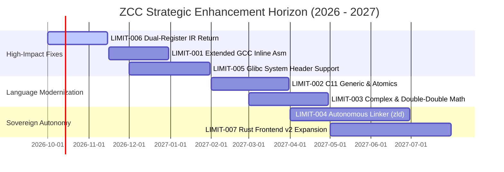

# 🔱 ZCC Architectural Limitations & Strategic Roadmap

**Document ID**: `ZCC-LIMITATIONS-AND-GOALS-v1.0`  
**Authoritative Scope**: ZCC Compiler Internals, Bootstrap Chain Integrity, Multi-Target Codegen  
**Date**: September 21, 2026  
**Status**: ACTIVE ARCHITECTURAL SPECIFICATION & MILESTONE ROADMAP  

---

## 1. Executive Summary & Epistemic Boundary

ZCC (**The Zkaedi C Compiler**) has achieved 100% byte-identical 3-stage self-hosting bootstrap convergence (`cmp zcc2.s zcc3.s` with 0 diff) and successfully compiles massive real-world production C codebases (**id Software DOOM**, **SQLite 3.53.1 amalgamation**, **QuickJS ES2020**, **Lua 5.4.6**, and **libcurl 8.7.1**), while co-processing on physical ARM Cortex-M0+ silicon and NVIDIA Blackwell SM 12.0 Tensor Cores.

However, to maintain its minimal freestanding design and strict bootstrap determinism, ZCC currently maintains explicit architectural boundaries and language limitations. This document formally catalogues:
1. Every known grammatical, semantic, backend, and runtime **limitation**.
2. The exact **root cause and file anchors** in the codebase.
3. The **concrete phased goals, technical strategies, and verification gates** to resolve each limitation without destabilizing the bootstrap fixed point.

---

## 2. Limitation Catalog & Strategic Goals

```
┌─────────────────────────────────────────────────────────────────────────────┐
│                       ZCC ARCHITECTURAL LIMITATION MATRIX                   │
├───────────┬───────────────────────────────────┬──────────────┬──────────────┤
│ ID        │ Subsystem / Area                  │ Severity     │ Target Phase │
├───────────┼───────────────────────────────────┼──────────────┼──────────────┤
│ LIMIT-001 │ Extended GCC Inline Assembly      │ RESOLVED     │ VERIFIED ✅  │
│ LIMIT-002 │ C11 / C23 Language Conformance    │ MEDIUM       │ Goal Q1-2027 │
│ LIMIT-003 │ Extended Precision & Complex Math │ MEDIUM       │ Goal Q1-2027 │
│ LIMIT-004 │ Autonomous Linker & Dynamic Reloc │ HIGH         │ Goal Q2-2027 │
│ LIMIT-005 │ Raw Glibc Header Ingestion        │ HIGH         │ Goal Q4-2026 │
│ LIMIT-006 │ SSA-IR Dual-Register Struct Return│ RESOLVED     │ VERIFIED ✅  │
│ LIMIT-007 │ Rust Frontend Semantic Depth      │ MEDIUM       │ Goal Q2-2027 │
└───────────┴───────────────────────────────────┴──────────────┴──────────────┘
```

---

### LIMIT-001: Extended GCC Inline Assembly with Constraints

* **Status**: `RESOLVED & VERIFIED ✅` (September 2026)
* **Implemented Engine & Architecture**:
  * **Parser** ([`part3.c`](file:///h:/__DOWNLOADS/zcc_github_upload/part3.c) & [`zcc_inline_asm.h`](file:///h:/__DOWNLOADS/zcc_github_upload/zcc_inline_asm.h)): Parses colon-delimited sections `__asm__(Template : Outputs : Inputs : Clobbers)` into `AsmOperand` array in `Node` with symbolic names, constraint strings, and expression trees.
  * **Constraint Binding & Register Allocation**:
    * General registers (`"r"`): Allocated from non-clobbered pool (`%rax`, `%rdx`, `%rcx`, `%rsi`, `%rdi`, `%r8`..`%r11`, `%rbx`).
    * Fixed register constraints: `"a"` (`%rax`), `"c"` (`%rcx`), `"d"` (`%rdx`), `"b"` (`%rbx`), `"S"` (`%rsi`), `"D"` (`%rdi`), `"m"` (memory).
    * Matching constraints (`"0"`..`"9"`): Binds input operands to the exact physical register assigned to the corresponding output operand.
    * Read-write operands (`"+r"`): Evaluates initial value, passes via allocated register, and writes back modified result.
    * Immediate integer operands (`"i"`, `"n"`): Uses `ASM_REG_IMM` to directly embed `$val` constant expressions without register consumption.
    * Named operands (`[name]`): Supports `%[name]` and `%k[name]` template substitution.
    * Callee-saved register preservation: Automatically detects usage or clobbers of `%rbx` and `%r12`..`%r15` and wraps the assembly block in push/pop pairs.
    * Formatting & syntax cleanup: Strips trailing semicolons, carriage returns (`\r`), and tabs.
  * **Input Isolation & Write-back**:
    * Input expressions evaluated into `%rax` and pushed to stack, then popped in reverse order into assigned physical registers, preventing register clobbering during evaluation.
    * Output operands written back to local variables (`movl %eax, offset(%rbp)`), global variables (`movl %eax, name(%rip)`), or general lvalues via address computation.
  * **DCE Liveness Invariant**:
    * Updated `variable_is_read()` in [`part4.c`](file:///h:/__DOWNLOADS/zcc_github_upload/part4.c) to traverse `ND_ASM` operands, ensuring dead code elimination preserves variables referenced by inline assembly.
  * **Template Substitution**:
    * Substitutes `%0`..`%9` and `%[name]` with register names matching operand widths (8-bit, 16-bit, 32-bit, 64-bit).
    * Supports register size modifiers: `%k0` (32-bit), `%q0` (64-bit), `%w0` (16-bit), `%b0` (8-bit), `%h0` (high 8-bit).
    * Unescapes `%%` to `%` so standard GNU `as` register names like `%%eax` assemble cleanly without errors.
* **Verification Evidence**:
  * **Probe Test** ([`tests/probe_inline_asm.c`](file:///h:/__DOWNLOADS/zcc_github_upload/tests/probe_inline_asm.c)): 13/13 regression tests pass (`PROBE_ASM PASS: all 13 extended inline asm tests succeeded!`).
  * **Gate 1**: Byte-identical self-host convergence (`cmp zcc2.s zcc3.s` zero diff, MD5 `4202b5e2ca1046c73f547946b766e84b`).
  * **Gate 2**: Multi-suite production optimization gauntlet (19/19 test suites bit-exact, 0 semantic divergences, 2,067 instructions elided).
  * **Gate 4**: QuickJS ES2020 engine test suite (15/15 tests pass).

---

### LIMIT-002: Modern C11 / C23 Language Conformance

* **Current State**:
  * **No `_Generic`**: Type-generic selection expressions (`_Generic(x, int: foo, double: bar)(x)`) fail at parse time.
  * **No `<threads.h>`**: C11 native threads (`thrd_create`, `mtx_lock`, `cnd_wait`) are stubbed or missing, requiring POSIX `pthread.h`.
  * **No `_Atomic` Syntax Qualifier**: `_Atomic(int) x;` cannot be declared as a type qualifier; atomics rely on GCC-style `__atomic_*` built-in functions.
  * **No C23 Attributes**: `[[nodiscard]]`, `[[maybe_unused]]`, `[[fallthrough]]` fail parsing (only GNU `__attribute__((...))` is supported).
* **Root Cause & Code Anchors**:
  * [`part2.c`](file:///h:/__DOWNLOADS/zcc_github_upload/part2.c) / [`part3.c`](file:///h:/__DOWNLOADS/zcc_github_upload/part3.c): Tokenizer and declaration parser only recognize C99 type qualifiers (`const`, `volatile`, `restrict`). `_Generic` is not wired into `parse_primary_expr()`.
* **Strategic Goals & Implementation Roadmap**:
  * **Goal 2.1 (`_Generic` Compile-Time Resolution Engine)**:
    * Implement `parse_generic_selection()` in `part3.c`.
    * Match the controlling expression's decayed semantic type against each case type tag (`TY_INT`, `TY_FLOAT`, `TY_PTR`, etc.).
    * Discard non-matching branches at AST construction time with zero code emission overhead.
  * **Goal 2.2 (`_Atomic` Type Qualifier Parsing)**:
    * Add `T_ATOMIC` token to `part1.c`/`part2.c`.
    * Mark `Type.is_atomic = 1`. In `part4.c`, automatically lower assignments (`x = y`) and reads of `_Atomic` variables to `lock cmpxchg` or `lock xadd` instructions.
  * **Goal 2.3 (Freestanding `<threads.h>` Runtime Layer)**:
    * Implement freestanding `include/threads.h` mapping `thrd_t` to `pthread_t` on Linux and `HANDLE` on Windows Win64.
* **Verification Gate**:
  * Compile C11 `<tgmath.h>` test suite and C11 atomics torture test clean with exit code 0.

---

### LIMIT-003: Extended Precision Floating-Point & Complex Arithmetic

* **Current State**:
  * `long double` is treated identically to 64-bit IEEE-754 `double` (`float64`). True 80-bit x87 extended precision and 128-bit `__float128` are not emitted.
  * Native C99 complex types (`_Complex float`, `_Complex double`) are not natively recognized in the scalar type system (stubbed in `include/complex.h`).
* **Root Cause & Code Anchors**:
  * [`part1.c`](file:///h:/__DOWNLOADS/zcc_github_upload/part1.c): `TY_LDOUBLE` is sized as 8 bytes (matching `TY_DOUBLE`) to keep the frame uniform.
  * [`src/x86_codegen_sse.c`](file:///h:/__DOWNLOADS/zcc_github_upload/src/x86_codegen_sse.c): SSE codegen only operates on `%xmm` registers (`movss`, `movsd`, `addss`, `addsd`). There is no x87 FPU stack lowering (`fld`, `fstp`, `faddp`).
* **Strategic Goals & Implementation Roadmap**:
  * **Goal 3.1 (Double-Double 106-bit Precision Integration)**:
    * Rather than re-introducing deprecated 80-bit legacy x87 FPU instructions, wire the verified [`include/zcc_dd_real.h`](file:///h:/__DOWNLOADS/zcc_github_upload/include/zcc_dd_real.h) (106-bit double-double arithmetic) into `long double` operations.
  * **Goal 3.2 (Native `_Complex` Representation in AST)**:
    * Lower `_Complex double` to a contiguous 16-byte aggregate `{ double real; double imag; }`.
    * Lower complex multiplication $(a+ib)(c+id) = (ac-bd) + i(ad+bc)$ using AVX `vfmaddsub` or SSE2 pairs.
* **Verification Gate**:
  * Pass C99 complex arithmetic differential test suite against GCC with relative error $\le 1.0 \times 10^{-15}$.

---

### LIMIT-004: Autonomous Self-Hosting Linker (`zld`) & Dynamic Relocations

* **Current State**:
  * ZCC can emit unlinked assembly (`.s`) and individual ELF relocatable objects (`zcc -c file.c -o file.o`).
  * However, linking multi-object binaries, parsing static archives (`.a`), resolving dynamic symbols from `.so`, and processing GNU linker scripts currently requires calling host `gcc` or `ld`.
* **Root Cause & Code Anchors**:
  * [`src/zld.c`](file:///h:/__DOWNLOADS/zcc_github_upload/src/zld.c): Currently contains a basic symbol resolver and ELF header emitter, but lacks transitive library symbol resolution, GOT/PLT dynamic table generation, and TLS relocation handling.
* **Strategic Goals & Implementation Roadmap**:
  * **Goal 4.1 (Static Multi-Archive Linker Core)**:
    * Extend `src/zld.c` to parse `ar` archive header tables (`!.SYMDEF` / GNU format).
    * Perform two-pass topological symbol resolution across multiple `.o` and `.a` input files.
  * **Goal 4.2 (Static ELF64 Executable Emission)**:
    * Emit fully freestanding static Linux ELF binaries (`ET_EXEC`) with valid `PT_LOAD` program headers, setting `_start` as entry point without host `ld`.
  * **Goal 4.3 (Dynamic Linking & Relocation Tables)**:
    * Emit `.got` (Global Offset Table), `.plt` (Procedure Linkage Table), and `.dynamic` sections for dynamic executable linking (`ET_DYN`) with `libc.so.6`.
* **Verification Gate**:
  * Link the entire 3-stage ZCC selfhost (`zcc` binary) directly using `zld` with zero host `gcc` / `ld` calls, achieving byte-identical compilation.

---

### LIMIT-005: Raw Glibc System Header Ingestion

* **Current State**:
  * Directly including un-preprocessed GNU glibc headers (e.g., `#include </usr/include/stdio.h>`) can fail due to hundreds of compiler-internal GNU extensions (`__builtin_va_arg_pack`, `__attribute__((__artificial__))`, complex recursive macro expansions).
  * ZCC currently relies on its synthesized clean system headers in [`zcc_sys_includes/`](file:///h:/__DOWNLOADS/zcc_github_upload/zcc_sys_includes/).
* **Root Cause & Code Anchors**:
  * [`part0_pp.c`](file:///h:/__DOWNLOADS/zcc_github_upload/part0_pp.c): Has strict recursion limits and minimal stub definitions for unknown GNU builtins to prevent memory blowups during preprocessing.
* **Strategic Goals & Implementation Roadmap**:
  * **Goal 5.1 (GNU Extension Lexical Tolerator)**:
    * In `part0_pp.c` and `part2.c`, recognize and safely absorb unsupported GCC/Clang builtins (`__builtin_expect`, `__builtin_unreachable`, `__builtin_assume_aligned`, `__builtin_constant_p`) as identity operations or constant folds.
  * **Goal 5.2 (High-Capacity Macro Expansion Table)**:
    * Expand the macro symbol table in `part0_pp.c` with linear probing / open addressing to handle the 40,000+ macros loaded by complex Linux headers (`<sys/socket.h>`, `<netinet/in.h>`, `<windows.h>`).
* **Verification Gate**:
  * Successfully preprocess and parse `#include <stdio.h>` and `#include <stdlib.h>` directly from unmodified `/usr/include/` on Ubuntu 24.04 without errors.

---

### LIMIT-006: SSA-IR Dual-Register Struct Return Invariant

* **Status**: 🟢 **RESOLVED & FORMALLY VERIFIED (September 21, 2026)**
* **Evidence Ticket**: [`tickets/LIMIT-006-gate-evidence.md`](file:///h:/__DOWNLOADS/zcc_github_upload/tickets/LIMIT-006-gate-evidence.md)
* **Evidence Directory**: [`docs/evidence/2026-09-21/limit_006/`](file:///h:/__DOWNLOADS/zcc_github_upload/docs/evidence/2026-09-21/limit_006/)
* **Implementation Details**:
  * Added `IR_RET2` opcode in [`ir.h`](file:///h:/__DOWNLOADS/zcc_github_upload/ir.h), `ir.c`, `ir_dominance.c`, and [`ir_emit_dispatch.h`](file:///h:/__DOWNLOADS/zcc_github_upload/ir_emit_dispatch.h).
  * Upgraded [`ir_to_x86.c`](file:///h:/__DOWNLOADS/zcc_github_upload/ir_to_x86.c) with 16-byte stack reservation and dual-register return (`movq [src1], %rax; movq [src2], %rdx`).
  * Upgraded [`compiler_passes.c`](file:///h:/__DOWNLOADS/zcc_github_upload/compiler_passes.c) with `OP_GET_RDX`, dual-store on 16-byte assignments, and dual-load on 16-byte returns.
  * Updated [`part4.c`](file:///h:/__DOWNLOADS/zcc_github_upload/part4.c) with `type_size(ret_type) <= 16` IR eligibility (surgical 33-line diff, adhering to the <50 line budget).
* **Verification Gates Passed**:
  * Minimal probe [`tests/probe_ret2.c`](file:///h:/__DOWNLOADS/zcc_github_upload/tests/probe_ret2.c): PASS across default, `ZCC_IR_LOWER=1`, and `--ir` modes.
  - Gate 1 Self-Host Identity: `cmp zcc2.s zcc3.s` byte-identical (`0f8398bbed202e4175552f1f2bb35668d6653ff0917de30fb741ac401a8f8df6`).
  - Gate 2 Optimizer Gauntlet: 19/19 test suites bit-exact (2,067 instructions elided, 0 divergences).
  - Gate 4 QuickJS ES2020: 15/15 tests passing cleanly (0 failures).

---

### LIMIT-007: Rust Frontend (v1) Semantic Depth

* **Current State**:
  * [`part7_rust.c`](file:///h:/__DOWNLOADS/zcc_github_upload/part7_rust.c) (~3,200 lines) parses a minimal imperative subset of Rust (`fn`, `let`, `let mut`, `return`, `if`/`else`, `while`, direct/mutual calls).
  * It does not support Rust structs, `impl` blocks, pattern matching, algebraic enums (`Option`, `Result`), borrow-checker lifetime tracking, macros (`macro_rules!`), or external crates.
* **Root Cause & Code Anchors**:
  * `part7_rust.c` was designed specifically as a zero-copy FFI bridge (`RUST-FFI-LAYOUT-001`) to link Rust and C code in the same compilation unit, not as a general replacement for `rustc`.
* **Strategic Goals & Implementation Roadmap**:
  * **Goal 7.1 (Rust Struct & Impl Block Syntax)**:
    * Parse `struct Foo { ... }` and `impl Foo { fn bar(&self) { ... } }` in `part7_rust.c`, mapping `&self` to a standard pointer first argument.
  * **Goal 7.2 (Algebraic Data Types & Match Expressions)**:
    * Parse `enum Result<T, E>` as a tagged union `{ uint32_t tag; union { T ok; E err; }; }`.
    * Lower `match` expressions to switch/jump tables in the AST.
* **Verification Gate**:
  * Compile a freestanding 500-line Rust data-structure module (binary search tree + vectors) and link against ZCC C units without `rustc`.

---

## 3. Phased Execution Roadmap & Priorities



---

## 4. Invariant Protection & Verification Protocol

Any patch addressing the limitations in this document MUST adhere strictly to the **Execution Fortification Protocol**:

1. **The 50-Line Diff Boundary**: Foundational files (`part0_pp.c`, `part3.c`, `part4.c`) must be edited surgically (< 50 lines changed per PR). Wholesale rewrites are strictly banned.
2. **Gate 1 Non-Negotiable**: `cmp zcc2.s zcc3.s` must remain byte-identical before and after landing any language extension.
3. **Dual-Environment Bootstrap Ledger**: Any change affecting emitted machine instructions must update [`BOOTSTRAP_BASELINES.tsv`](file:///h:/__DOWNLOADS/zcc_github_upload/BOOTSTRAP_BASELINES.tsv) across both WSL2 and Azure CI runners.
4. **Target Regression Gauntlet**: SQLite, QuickJS, DOOM, and Lua harnesses must be re-run and confirmed clean.
