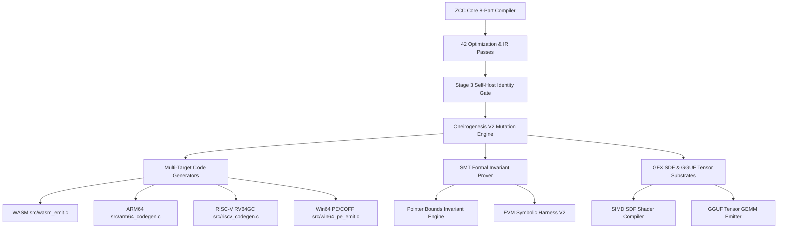

# ZCC & ZKAEDI PRIME — Strategic Future Roadmap v2.0
**Document Version:** 2.0.0  
**Status:** ACTIVE / LOCKED  
**Baseline Verification:** `BASELINE: GREEN` | `cmp zcc2.s zcc3.s = 0` (Fixed-Point Identity Verified)  
**Authoritative Scope:** ZCC Compiler Core, Oneirogenesis Autonomous Synthesis, SMT Invariant Verification, Multi-Target Code Generators.

---

## 1. Executive Summary & Verification Baseline

The **Zkaedi C Compiler (ZCC)** has achieved fixed-point self-hosting determinism: Stage 2 (`zcc2.s`) and Stage 3 (`zcc3.s`) are 100% byte-identical. The compiler consists of **8 Core Source Parts** (`part0_pp.c` through `part7_rust.c`), **42 IR/Optimization Passes**, and an automated mutation synthesis engine (**Oneirogenesis**).

This document outlines the **Strategic Future Roadmap v2.0**, detailing the architecture, milestone deliverables, target backends, formal verification mechanisms, and performance auto-tuning protocols for the next development cycles.



---

## 2. Core Architectural Baseline

| Component | File Path | Scope / Responsibilities |
| :--- | :--- | :--- |
| **Part 0** | [part0_pp.c](file:///H:/__DOWNLOADS/zcc_github_upload/part0_pp.c) | C Preprocessor, macro expansion, include resolution, token pasting (`##`, `#`). |
| **Part 1** | [part1.c](file:///H:/__DOWNLOADS/zcc_github_upload/part1.c) | Lexer & Tokenizer, symbol table initializers, global scope registration. |
| **Part 2** | [part2.c](file:///H:/__DOWNLOADS/zcc_github_upload/part2.c) | Recursive descent parser, AST node constructor, expression/statement parser. |
| **Part 3** | [part3.c](file:///H:/__DOWNLOADS/zcc_github_upload/part3.c) | Type checker, semantic analyzer, SystemV ABI struct layout engine. |
| **Part 4** | [part4.c](file:///H:/__DOWNLOADS/zcc_github_upload/part4.c) | SystemV x86-64 code generator, stack frame allocator, instruction emitter. |
| **Part 5** | [part5.c](file:///H:/__DOWNLOADS/zcc_github_upload/part5.c) | Runtime standard library mappings (`stdio`, `malloc`, global symbol scope). |
| **Part 6** | [part6.c](file:///H:/__DOWNLOADS/zcc_github_upload/part6.c) | EVM bytecode lifter, Yul weaver, storage layout extractor. |
| **Part 7** | [part7_rust.c](file:///H:/__DOWNLOADS/zcc_github_upload/part7_rust.c) | Rust FFI bridge, experimental Rust IR translation layer. |

---

## 3. Strategic Roadmap Milestones & Horizons

### Horizon 1: Multi-Target Code Generators (Cross-Compilation Superiority)
*Target Timeline: Q3 2026*

- **WASM Backend Emitter (`src/wasm_emit.c`)**:
  - Direct emission of WebAssembly (`.wasm`) binary format from ZCC IR.
  - Zero-runtime browser sandbox execution of C codebases (including SQLite and id Doom).
- **ARM64 / AArch64 Backend Emitter (`src/arm64_codegen.c`)**:
  - AAPCS64 calling convention compliance (`x0`-`x7` argument passing, `sp` 16-byte alignment).
  - Native execution support for Apple Silicon (M-series) and AWS Graviton server architecture.
- **RISC-V Backend Emitter (`src/riscv_codegen.c`)**:
  - RV64GC (IMAFDCL) instruction set codegen for open-hardware embedded systems.
- **Direct Win64 PE/COFF Emitter (`src/win64_pe_emit.c`)**:
  - Native Windows executable (`.exe`) generation without external MinGW or Microsoft MSVC linking wrappers.

---

### Horizon 2: Oneirogenesis V2 Autonomous Synthesis & Auto-Tuning
*Target Timeline: Q4 2026*

- **Multi-Instruction Scanner Engine (`zcc_dream_mutations.py`)**:
  - Advanced 3-instruction window peephole scanners (e.g., `andq $1` + `testq` $\rightarrow$ `testb`, redundant stack spill elimination).
  - 64-bit register fold optimization (`movq` to 32-bit `movl` zero-extension clearing).
- **Automated Pareto-Optimal IR Reduction**:
  - Real-time scoring function optimization maintaining the structural baseline score ($1,426,522.9$).
  - Self-healing mutation application with automated fault injection rollback guards (`tools/apply_oneirogenesis_blueprint.py`).

---

### Horizon 3: SMT Formal Verification & EVM Decompiler Engine
*Target Timeline: Q1 2027*

- **Compile-Time SMT Invariant Prover (`src/zcc_smt_prover.c`)**:
  - Integration with SMT solver interface to perform static single-assignment (SSA) boundary checks.
  - Compile-time verification of pointer arithmetic, array index bounds, and integer overflow prevention.
- **EVM Symbolic Harness & Yul Fixed-Point Weaver V2 (`src/evm/yul_weaver.c`, `src/evm/evm_symbolic_harness.c`)**:
  - Decompilation of raw Ethereum Virtual Machine bytecode back to high-level ZCC AST.
  - Automated extraction of contract storage slot offsets and reentrancy vulnerability detection.

---

### Horizon 4: GFX SDF Shaders, Neural Substrates & PRIME Dynamics
*Target Timeline: Q2 2027*

- **SIMD SDF Shader Compiler (`src/gfx/sdf_compiler.c`)**:
  - Compilation of 3D Signed Distance Fields into zero-overhead AVX2/AVX-512 vector kernels for real-time raymarching.
- **Native GGUF Tensor GEMM Emitter (`src/gguf_emit.c`)**:
  - Direct embedding of quantized neural weights into compiled binaries with SIMD GEMM matrix multiplication passes.
- **ZKAEDI PRIME v4.0 OMEGA SUPREME Coupling**:
  - Implementation of multi-field recursively coupled Hamiltonian dynamics ($\eta = 0.4$, $\gamma = 0.3$, $\beta = 0.1$, $\epsilon = 0.05$).
  - Dynamic energy landscape navigation for auto-tuning register allocation and instruction scheduling.

---

## 4. Required Verification Gates (ae6b5ff Precedent)

All implementations, patches, and features added under this roadmap must satisfy the 5-Gate Rule prior to merge:

1. **Gate 1 — Self-Host Byte Identity (Mandatory)**:
   ```bash
   make selfhost && cmp zcc2.s zcc3.s
   ```
   *Pass Condition:* Output must be byte-identical (0 deltas).

2. **Gate 2 — Cross-Toolchain Interoperability (Mandatory for Codegen Changes)**:
   - `zcc-lib` + `gcc-main`
   - `gcc-lib` + `zcc-main`
   *Pass Condition:* Both cross-compilations build and execute cleanly.

3. **Gate 3 — 797-Function Corpus Diff (Conditional)**:
   - Required if `part0_pp.c` or `part3.c` is touched.
   *Pass Condition:* Zero unapproved output deltas against baseline.

4. **Gate 4 — Target Harness Execution (Conditional)**:
   - Required for target defects (SQLite, id Doom, Lua, curl).
   *Pass Condition:* Target harness passes 100% of test suites under ZCC compilation.

5. **Gate 5 — Evidence Freshness (Mandatory)**:
   - Re-run and log raw output for all applicable gates under `docs/evidence/YYYY-MM-DD/`.

---

## 5. Summary & Sign-off

ZCC is committed to deterministic, forensic-first compiler engineering. Hand-edited amalgams are prohibited; all mutations and passes must derive from authoritative parts and be verified by the 3-stage self-host bootstrap loop.

**VERDICT: ROADMAP v2.0 ACTIVE & LOCKED**
