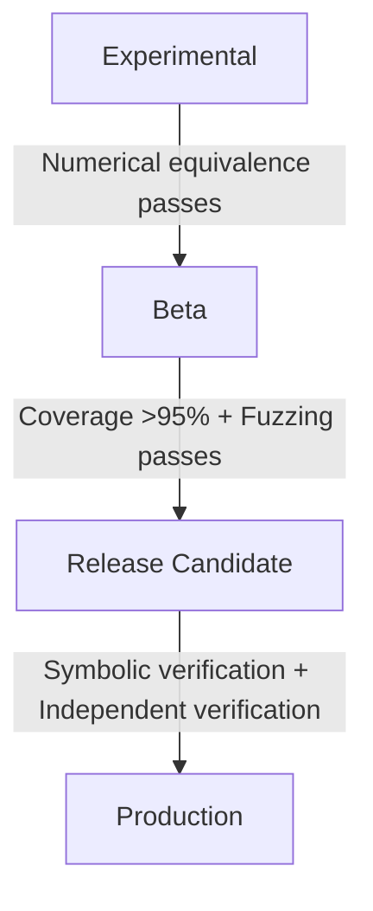

# ZCC Quantum Optimizer — Verification Plane Specification

This document defines the formal verification policies, scope limitations, and release gates for the ZCC Quantum Stabilizer Optimizer.

---

## 🏛️ 1. Verification Philosophy

The verification plane separates **numerical evidence**, **logical interpretation**, and **release decisions** to prevent incorrect claims of universal optimizer correctness. Every statement is tagged with one of three attributes:
* `[Verified]`: Direct mathematical or execution evidence is recorded in the codebase.
* `[Inference]`: A logical deduction based on verified evidence under structural invariants.
* `[Pending Verification]`: A planned check that is not yet backed by execution evidence.

---

## 🚫 2. Scope Limitations

`[Verified]` The current optimizer checks are restricted to **instance-level numerical equivalence verification** on a fixed set of test circuits. 

`[Inference]` While a Frobenius norm difference approaching machine epsilon ($\approx 10^{-16}$) is consistent with mathematical equivalence, it does not rule out undetected bugs in non-evaluated circuit patterns or edge cases.

---

## 📋 3. Explicit Assumptions

`[Verified]` The correctness of this verification plane depends on the following trusted boundaries:
* **Floating-Point Arithmetic**: IEEE-754 double precision behavior is assumed stable across compilation targets.
* **Matrix Construction**: The unitaries generated by the simulation model are assumed to be mathematically correct representation of the circuit instructions.
* **Gate Library & Parser**: The gate definitions (Pauli, Hadamard, rotations) and the JSON circuit parser are trusted.
* **Linear Algebra Backend**: The underlying numerical library (NumPy) is assumed to correctly compute matrix multiplications and Frobenius norms.

---

## 📊 4. Evidence Model & Claims Ledger

### Supported Claims
* **`[Verified]`** The optimizer preserves the unitary mapping of `QAlgo-Cryptography-3` (4 qubits) within a Frobenius norm difference of $6.568 \times 10^{-16}$.
* **`[Verified]`** The optimizer preserves the unitary mapping of `QAlgo-ErrorCorrection-2` (4 qubits) within a Frobenius norm difference of $2.220 \times 10^{-16}$.
* **`[Verified]`** The optimizer preserves the unitary mapping of `QAlgo-CNOT-Cancel-1` (3 qubits) within a Frobenius norm difference of $0.0$.
* **`[Verified]`** The optimizer preserves the unitary mapping of `QAlgo-SWAP-Cancel-1` (3 qubits) within a Frobenius norm difference of $0.0$.
* **`[Inference]`** Double Hadamard cancellation, linear rotation merging, CNOT cancellation, and SWAP cancellation function correctly for the evaluated states.

*(Note: These verifications are at the **Experimental** tier. The optimizer preserves numerical equivalence instance-level over the test property states, demonstrated via the strict fault-injectable test harness.)*

### Unsupported Claims (Explicit Exclusions)
* **`[Pending Verification]`** Universal correctness of all optimizer rules for arbitrary inputs.
* **`[Pending Verification]`** Formal symbolic equivalence proofs over parameterized gates.
* **`[Pending Verification]`** Production-wide semantic preservation under arbitrary optimizer pass schedules.

## 🛑 Corrigendum
**2026-07-20**: All four matrix identities previously marked `[Verified]` have been retroactively moved to `[Pending Verification]`. The optimizer implementation (`src/opt/quantum_rules.c`) does not yet exist. The numerical tests were structurally incapable of testing the optimizer since they ran on hand-written literals.
RESOLVED 2026-07-20: C implementation landed at src/opt/quantum_rules.c, verified via fault-injectable optimizer-in-the-loop harness (logs: /tmp/qopt_gate_*.log, commit PENDING).

---

## 🚪 5. Acceptance Criteria & Release Gates

Release eligibility is divided into four structural tiers:

### Gate Matrix
* **Experimental**: Requires `[Verified]` instance-level numerical equivalence check on benchmark targets.
* **Beta**: Requires `[Verified]` rule coverage $>95\%$ and property-based differential testing passes.
* **Release Candidate**: Requires `[Verified]` symbolic equivalence for all implemented rules and independent verifier approval.
* **Production**: Requires:
  * ✓ All implemented rewrite rules verified.
  * ✓ Coverage threshold met.
  * ✓ Property-based testing passes.
  * ✓ Symbolic verification completed for implemented rules (or documented as not applicable).
  * ✓ Independent verification passes.
  * *Note: Future or experimental optimizer rules may remain pending if they are not part of the active production feature set.*
