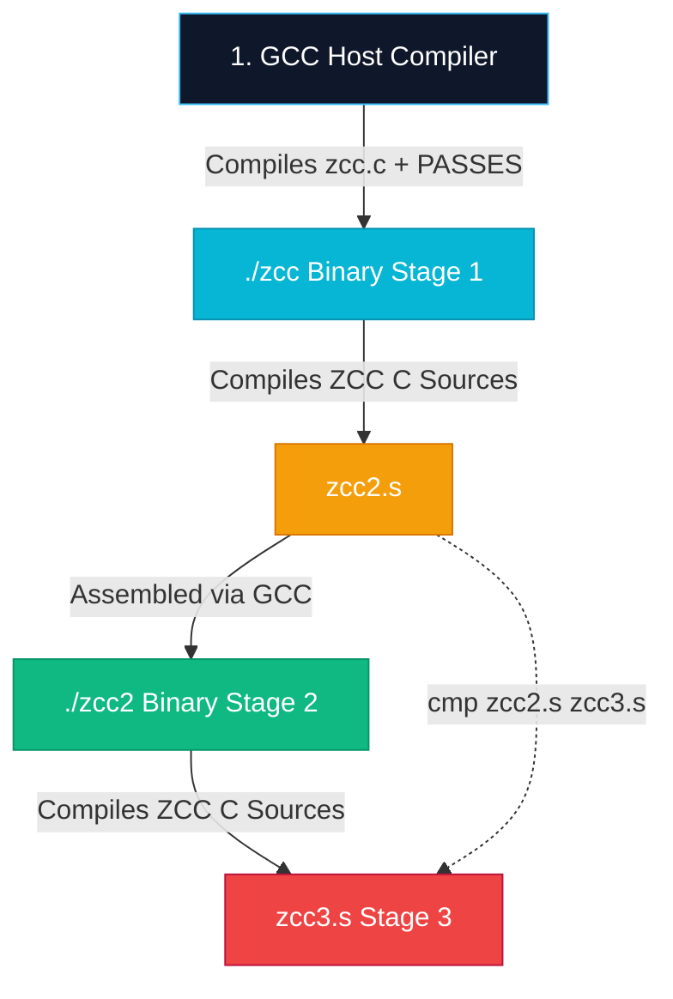

# ZCC Compiler Pipeline: Parts, Passes & Compilation Architecture

This document provides an exhaustive breakdown of all source code files compiled into the **ZCC C Compiler**, detailing the core compiler stages (`PARTS`), middle-end optimization modules (`PASSES`), and the 3-stage bootstrap self-host chain.

---

## 1. Core Compiler Parts (`PARTS`)

When ZCC builds, the source parts are concatenated into the single amalgamation `zcc.c`:

```bash
cat part1.c part0_pp.c part2.c part3.c ir.h ir_emit_dispatch.h sym_type_ast_ir.c part4.c zcc_ast_serializer.c part5.c part7_rust.c part6_arm.c ir.c ir_to_x86.c regalloc.c ir_telemetry_stub.c forgezero_receipt_stub.c zcc_layout.c zcc_layout_dump.c zcc_static_assert.c > zcc.c
```

### Module Responsibilities

| File | Compiler Stage | Subsystem Description |
| :--- | :--- | :--- |
| **`part0_pp.c`** | C Preprocessor | Macro expansion, `#include` resolution, include guards, conditional compilation (`#ifdef`/`#ifndef`). |
| **`part1.c`** | Lexer & Tokenizer | Converts raw C source characters into lexemes, keyword tokens, and symbol table identifiers. |
| **`part2.c`** | Parser | Constructs Abstract Syntax Trees (AST) for C expressions, statements, control flow, and function definitions. |
| **`part3.c`** | Semantic Analyzer | Type checking, struct offset evaluation, System V AMD64 ABI classification, and pointer decay rules. |
| **`part4.c`** | IR SSA Bridge | Lowers AST into 3-address Intermediate Representation (IR), builds Control Flow Graphs (CFG), and computes stack frame layouts. |
| **`part5.c`** | X86-64 Code Generator | Emits System V AMD64 assembly instructions (`movq`, `cmpq`, `testq`, `call`, `ret`) and manages register allocation. |
| **`part6_arm.c`** | ARM64 Backend | Emits AArch64 assembly instructions for ARM targets. |
| **`part7_rust.c`** | Rust FFI Bridge | Generates C-to-Rust binding interfaces and memory layout wrappers. |
| **`regalloc.c`** | Register Allocator | Chaitin-Briggs graph coloring register allocation and spill slot management. |

---

## 2. Optimization & Subsystem Passes (`PASSES`)

ZCC links **42 specialized pass modules** (`PASSES`) during compilation:

### A. Middle-End Optimization Passes
- **`src/opt/instcombine_pass.c`**, **`instcombine_rules.c`**, **`instcombine_dispatch.c`**: Algebraic instruction combining and peep-hole simplifications.
- **`src/opt/sccp_pass.c`**: Sparse Conditional Constant Propagation.
- **`src/opt/cfg_simplify_pass.c`**: Control Flow Graph simplification and basic block merging.
- **`src/opt/loop_unroll_pass.c`**, **`loop_validator.c`**: Loop unrolling and invariant code motion.
- **`src/opt/inline_pass.c`**: Function inlining engine.
- **`src/opt/pointer_ssa.c`**: Pointer alias analysis and Memory SSA construction.
- **`src/opt/prime_v2_regalloc_opt.c`**: PRIME v2.0 graph coloring register allocation optimizer.

### B. Formal Verification & Security Subsystems
- **`src/zcc_smt_prover.c`**: SMT solver integration for formal verification of generated IR.
- **`ir_pass_warden.c`**: Pre- and post-pass invariant auditor (guards G-05, G-06, G-07).
- **`ir_pass_taint.c`**, **`ir_vuln_tag.c`**: Taint tracking and vulnerability classification tagging.
- **`ir_pass_healer.c`**: Automated AST/IR taint recovery pass.
- **`src/zcc_resource_oracle.c`**, **`src/zcc_oracle_substrate.c`**: Resource constraint and execution budget tracking.

### C. Specialized Target Emitters & Domain Extensions
- **`evm_lifter.c`**, **`src/evm/decompiler.c`**, **`src/evm/jit.c`**, **`src/evm/symbolic.c`**: Ethereum Virtual Machine bytecode lifter, JIT compiler, and symbolic execution harness.
- **`src/gfx/sdf_compiler.c`**, **`src/gfx/mesh_warden.c`**: Graphics Signed Distance Field (SDF) compiler & VRAM mesh auditor.
- **`src/gguf_emit.c`**: GGUF tensor format serializer for neural weights.
- **`src/zld.c`**: Embedded lightweight linker driver.

---

## 3. The 3-Stage Bootstrap Self-Host Chain

When `make selfhost` runs, ZCC compiles itself through 3 sequential stages:



### Self-Host Commands & Verification

```bash
# 1. Compile Host Compiler
make zcc

# 2. Execute 3-Stage Self-Host Gate
make selfhost && cmp zcc2.s zcc3.s
```

**Verdict Guarantee**: `cmp zcc2.s zcc3.s` returning exit code `0` verifies that `zcc2.s` and `zcc3.s` are **100% byte-identical**, proving zero state drift and complete fixed-point mathematical convergence across the entire compiler suite.
